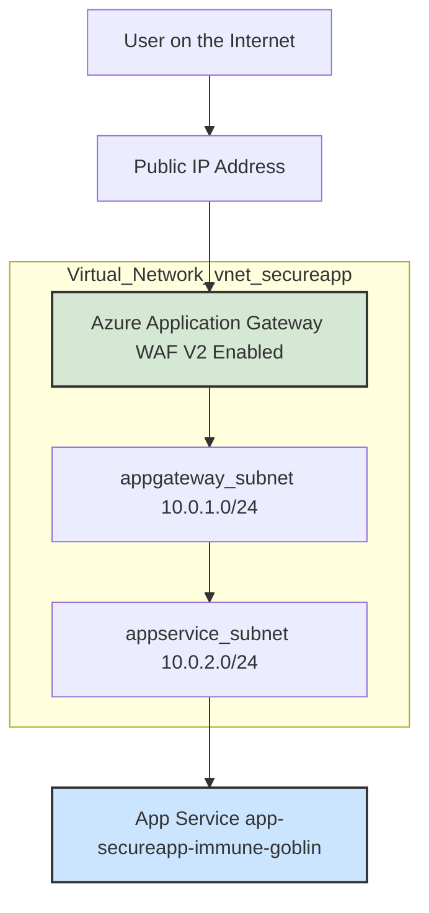
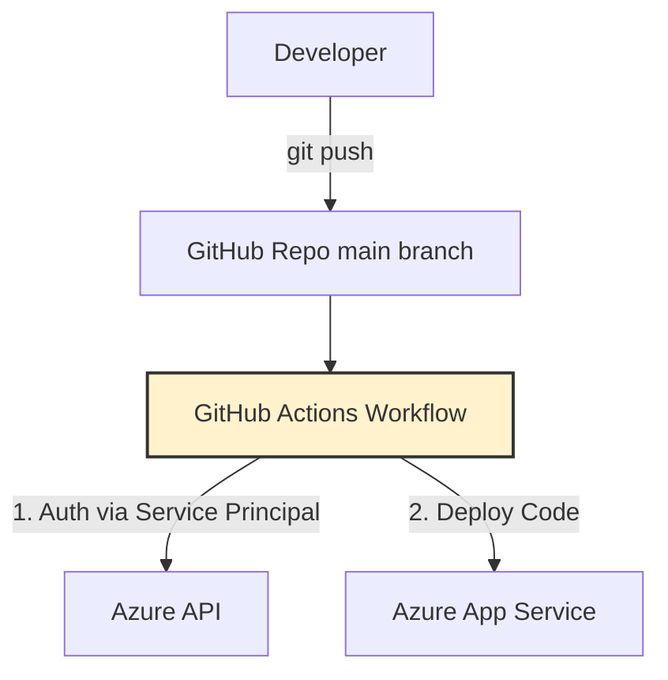

# 🚀 Azure Secure CI/CD Web App Deployment with Terraform & GitHub Actions

**Status:** ✅ Completed  
**Cloud:** Microsoft Azure  
**IaC:** Terraform  
**CI/CD:** GitHub Actions

---

## 📚 Project Overview

This project demonstrates a best-practice, security-focused approach to deploying a Python (Flask) web application on Microsoft Azure using Infrastructure as Code (Terraform) and automated deployment with GitHub Actions. The entire workflow is secure, automated, and repeatable—ideal for Cloud, DevOps, or Security Engineering roles.

---

## 🎯 Objectives

- **Provision** complete Azure infrastructure via Terraform (IaC principles).
- **Implement** a secure network architecture: isolate the app with Virtual Network & Application Gateway (with WAF).
- **Automate** deployment with a robust GitHub Actions CI/CD pipeline, triggered on every push to `main`.
- **Gain hands-on** with key Azure services: App Service, Application Gateway, Virtual Network.
- **Demonstrate** modern Cloud, DevOps & Security best practices.

---

## 🏗️ Architecture

### 🔒 Security-First Network Design



- **All traffic** enters via Application Gateway (WAF).
- **WAF** inspects traffic for threats (SQL Injection, XSS, etc.) and blocks malicious requests.
- **App Service** is in an isolated subnet with **no public IP**; only reachable through the Gateway.

---

### 🔄 CI/CD Workflow



- **git push** to `main` triggers the workflow.
- Workflow **authenticates securely** to Azure using Service Principal credentials.
- Deploys **latest code** to App Service automatically.

---

## 🛠️ Tech Stack

| Layer               | Technology                         |
| ------------------- | ---------------------------------- |
| **Cloud**           | Azure                              |
| **IaC**             | Terraform                          |
| **CI/CD**           | GitHub Actions                     |
| **App Hosting**     | Azure App Service (Python/Flask)   |
| **Security**        | Application Gateway (WAF V2)       |
| **Networking**      | Virtual Network, Subnets           |
| **Entry Point**     | Azure Public IP                    |
| **Subscription**    | Azure for Students                 |

---

## 💡 Key Skills Demonstrated

### Cloud Engineering & DevOps

- **Terraform IaC:** Full infra provisioning & management.
- **CI/CD Automation:** GitHub Actions for zero-touch deployments.
- **Azure Resource Management:** Deploy/configure PaaS resources.
- **Cost Management:** Monitor/analyze cloud spending.

### Cloud Security & Networking

- **Secure Network Design:** Isolated VNets & subnets.
- **WAF:** Application Gateway with OWASP rules.
- **IAM:** Scoped Service Principal (least privilege) for GitHub Actions.

### Version Control & Troubleshooting

- **Git & GitHub:** End-to-end VCS workflows.
- **Advanced Problem Solving:** 
  - Git conflicts & history rewrites (reset, pull, rebase).
  - Terraform state/provider issues.
  - File size limits & dependency management.

---

## 📂 Repository Structure

```
.
├── .github/workflows/         # GitHub Actions CI/CD pipelines
├── terraform/                 # All Terraform IaC modules & configs
├── app/                       # Python Flask web application code
├── README.md                  # This documentation
└── ...
```

---

## 📎 Notes

- **For learning, reference, or direct use in your own secure Azure deployments.**
- **Contact:** [grapitycreation on GitHub](https://github.com/grapitycreation)

---

> _Designed for students and professionals aiming for excellence in secure, automated cloud deployments!_
