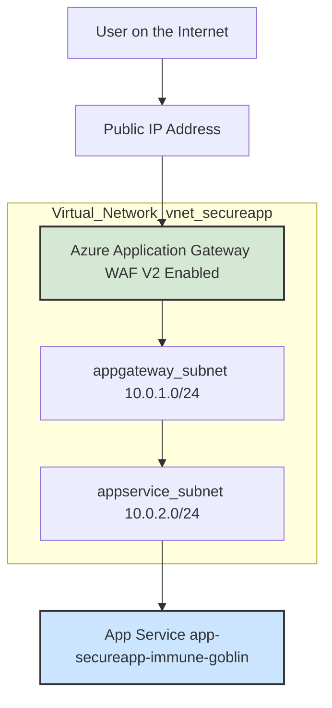
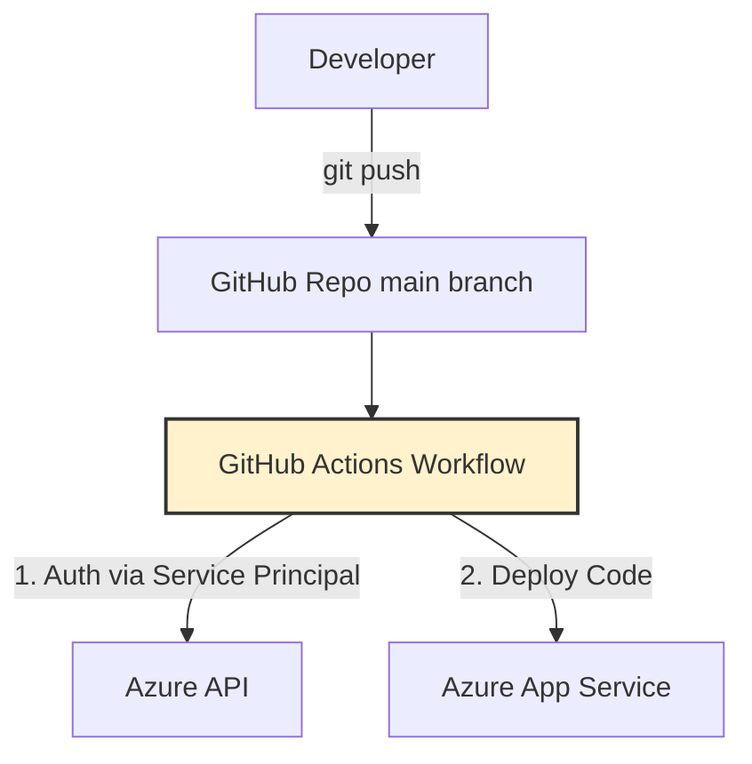

# 🚀 Azure Secure CI/CD Web App Deployment with Terraform & GitHub Actions

**Status:** ✅ Completed  
**Cloud:** Microsoft Azure  
**IaC:** Terraform  
**CI/CD:** GitHub Actions

---

## 📚 Project Overview

This project demonstrates a best-practice, security-focused approach to deploying a Python (Flask) web application on Microsoft Azure using Infrastructure as Code (Terraform) and automated deployment with GitHub Actions. The entire workflow is secure, automated, and repeatable—ideal for Cloud, DevOps, or Security Engineering roles.

---

## 🎯 Objectives

- **Provision** complete Azure infrastructure via Terraform (IaC principles).
- **Implement** a secure network architecture: isolate the app with Virtual Network & Application Gateway (with WAF).
- **Automate** deployment with a robust GitHub Actions CI/CD pipeline, triggered on every push to `main`.
- **Gain hands-on** with key Azure services: App Service, Application Gateway, Virtual Network.
- **Demonstrate** modern Cloud, DevOps & Security best practices.

---

## 🏗️ Architecture

### 🔒 Security-First Network Design



- **All traffic** enters via Application Gateway (WAF).
- **WAF** inspects traffic for threats (SQL Injection, XSS, etc.) and blocks malicious requests.
- **App Service** is in an isolated subnet with **no public IP**; only reachable through the Gateway.

---

### 🔄 CI/CD Workflow



- **git push** to `main` triggers the workflow.
- Workflow **authenticates securely** to Azure using Service Principal credentials.
- Deploys **latest code** to App Service automatically.

---

## 🛠️ Tech Stack

| Layer               | Technology                         |
| ------------------- | ---------------------------------- |
| **Cloud**           | Azure                              |
| **IaC**             | Terraform                          |
| **CI/CD**           | GitHub Actions                     |
| **App Hosting**     | Azure App Service (Python/Flask)   |
| **Security**        | Application Gateway (WAF V2)       |
| **Networking**      | Virtual Network, Subnets           |
| **Entry Point**     | Azure Public IP                    |
| **Subscription**    | Azure for Students                 |

---

## 💡 Key Skills Demonstrated

### Cloud Engineering & DevOps

- **Terraform IaC:** Full infra provisioning & management.
- **CI/CD Automation:** GitHub Actions for zero-touch deployments.
- **Azure Resource Management:** Deploy/configure PaaS resources.
- **Cost Management:** Monitor/analyze cloud spending.

### Cloud Security & Networking

- **Secure Network Design:** Isolated VNets & subnets.
- **WAF:** Application Gateway with OWASP rules.
- **IAM:** Scoped Service Principal (least privilege) for GitHub Actions.

### Version Control & Troubleshooting

- **Git & GitHub:** End-to-end VCS workflows.
- **Advanced Problem Solving:** 
  - Git conflicts & history rewrites (reset, pull, rebase).
  - Terraform state/provider issues.
  - File size limits & dependency management.

---

## 📂 Repository Structure

```
.
├── .github/workflows/         # GitHub Actions CI/CD pipelines
├── terraform/                 # All Terraform IaC modules & configs
├── app.py                       # Python Flask web application code
├── README.md                  # This documentation
└── ...
```

---

## 🏆 Project Execution Steps & Milestones
This section documents the step-by-step process of building the project from the ground up, including key commands and screenshots of the results at each stage.

### Step 1: Foundation & Local Setup
Initialized a local project directory.
Developed a simple Python Flask application (app.py) to act as the workload.
Created a requirements.txt file to manage Python dependencies.
Established a remote repository on GitHub and performed the initial commit.
Installed and configured all necessary local tools: Git, Azure CLI, and Terraform.


### Step 2: Provisioning the Core Infrastructure with Terraform
Authenticated with Azure using the Azure CLI: az login.
Created the initial Terraform configuration files: provider.tf, main.tf, variables.tf.
Ran terraform init to initialize the project and download the Azure provider.
Executed terraform apply to provision the foundational Azure Resource Group (rg-secureapp-project). This served as the container for all subsequent resources.
 

### Step 3: Building the Network Foundation
Updated the Terraform configuration to include an Azure Virtual Network (VNet) (vnet-secureapp) and two dedicated subnets:
snet-appgateway: For the Application Gateway.
snet-appservice: For the App Service's VNet integration.
Ran terraform apply to deploy the network resources. (The NetworkWatcherRG was automatically created by Azure.)


### Step 4: Deploying the Secure Gateway (Application Gateway & WAF)
Added azurerm_public_ip and azurerm_application_gateway resources in Terraform.
Configured the Application Gateway with the WAF_v2 SKU and enabled the OWASP 3.2 ruleset in Prevention mode.
The deployment of the Application Gateway was a long-running operation that successfully provisioned the secure entry point for the application.
 

### Step 5: Deploying the Application Host (App Service)
Added azurerm_service_plan (B1 SKU) and azurerm_linux_web_app to the configuration.
Resolved a MissingSubscriptionRegistration error by running:
sh
az provider register --namespace Microsoft.Web
Successfully deployed the App Service and configured its VNet Integration.


### Step 6: Completing the Traffic Flow
Modified the azurerm_application_gateway Terraform resource to connect it to the App Service.
Created a Health Probe to monitor App Service availability.
Updated the Backend Pool to point to the App Service's FQDN.
Verified the traffic flow by accessing the Application Gateway's public IP.


### Step 7: Implementing CI/CD Automation with GitHub Actions
Created a Service Principal in Azure with "Contributor" permissions scoped to the project's Resource Group.
Stored the Service Principal's JSON credentials securely as a repository secret (AZURE_CREDENTIALS) in GitHub.
Created a CI/CD workflow file: .github/workflows/deploy.yml.
On pushing the workflow file to main, the GitHub Actions pipeline was triggered, logging into Azure and deploying the application automatically.
    

### Step 8: Final Result & Project Teardown
The final result is a live web application, served securely through the Application Gateway, and deployed automatically via a CI/CD pipeline.
Project lifecycle was completed by running terraform destroy to cleanly remove all created resources from Azure.


## Demo
Youtube: https://youtu.be/D0LehPJVC98

Google Drive: https://drive.google.com/file/d/1tZJMF5KWESNNB_rvTf-L6Y9qaAaGnG5Q/view?usp=sharing

## 📎 Notes

- **For learning, reference, or direct use in your own secure Azure deployments.**
- **Contact:** [grapitycreation on GitHub](https://github.com/grapitycreation)

---

> _Designed for students and professionals aiming for excellence in secure, automated cloud deployments!_
